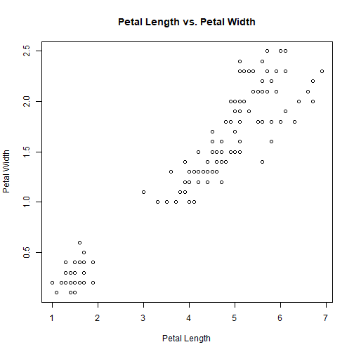
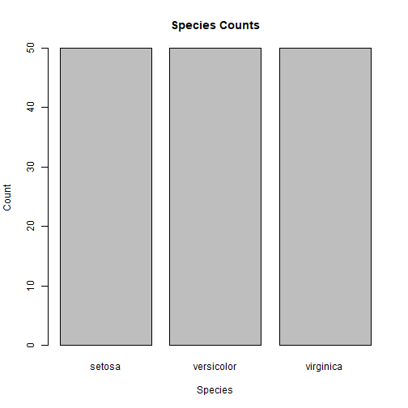
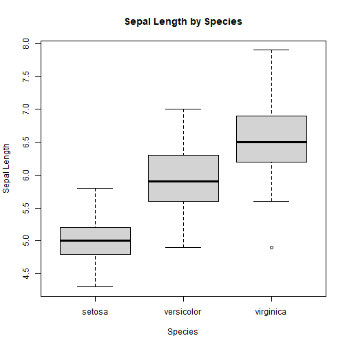
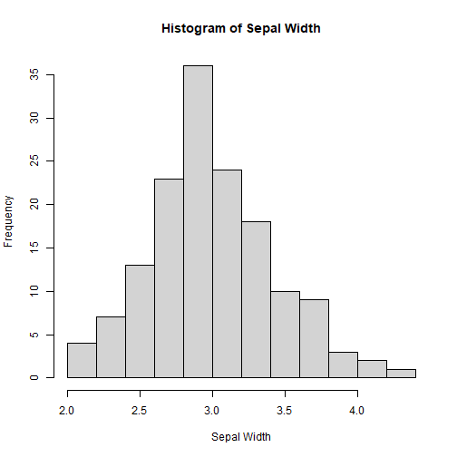
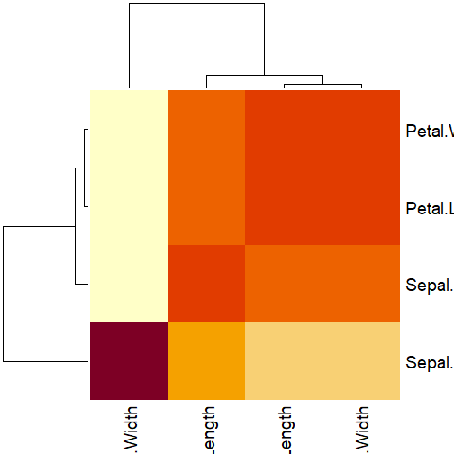

# Exercise 13: Data Analysis in R
2024-08-31

<!--html_preserve--><details>
  <summary>Lecture index</summary>

- [Lecture 1: Introduction to R](/lectures/lecture_01/lecture_01.md)
- [Lecture 2: Objects, Data Types, and Variables in R](/lectures/lecture_02/lecture_02.md)
- [Lecture 3: Arithmetic Operations in R](/lectures/lecture_03/lecture_03.md)
- [Lecture 4: Comparison and Logical Operators in R](/lectures/lecture_04/lecture_04.md)
- [Lecture 5: Vectors in R](/lectures/lecture_05/lecture_05.md)
- [Lecture 6: List in R](/lectures/lecture_06/lecture_06.md)
- [Lecture 7: Matrices in R](/lectures/lecture_07/lecture_07.md)
- [Lecture 8: Data Frames in R](/lectures/lecture_08/lecture_08.md)
- [Lecture 9: Functions in R](/lectures/lecture_09/lecture_09.md)
- [Lecture 10: Indexing using Logical Vectors in R](/lectures/lecture_10/lecture_10.md)
- [Lecture 11: Factors in R](/lectures/lecture_11/lecture_11.md)
- [Lecture 12: Control Structures in R](/lectures/lecture_12/lecture_12.md)
- [Lecture 13: A real-world example of using R for data analysis](/lectures/lecture_13/lecture_13.md)

</details><!--/html_preserve--><!--html_preserve--><details>
  <summary>Exercise index</summary>

  - [Exercise 1: Introduction to R](/exercises/exercise_01/exercise_01.md)
  - [Exercise 1 Solutions: Introduction to R](/exercises/exercise_01/exercise_01_solutions.md)
  - [Exercise 2: Objects, Data Types, and Variables in R](/exercises/exercise_02/exercise_02.md)
  - [Exercise 2 Solutions: Objects, Data Types, and Variables in R](/exercises/exercise_02/exercise_02_solutions.md)
  - [Exercise 3: Arithmetic Operations in R](/exercises/exercise_03/exercise_03.md)
  - [Exercise 3 Solutions: Arithmetic Operations in R](/exercises/exercise_03/exercise_03_solutions.md)
  - [Exercise 4: Comparison and Logical Operators in R](/exercises/exercise_04/exercise_04.md)
  - [Exercise 4 Solutions: Comparison and Logical Operators in R](/exercises/exercise_04/exercise_04_solutions.md)
  - [Exercise 5: Vectors in R](/exercises/exercise_05/exercise_05.md)
  - [Exercise 5 Solutions: Vectors in R](/exercises/exercise_05/exercise_05_solutions.md)
  - [Exercise 6: List in R](/exercises/exercise_06/exercise_06.md)
  - [Exercise 6 Solutions: List in R](/exercises/exercise_06/exercise_06_solutions.md)
  - [Exercise 7: Matrices in R](/exercises/exercise_07/exercise_07.md)
  - [Exercise 7 Solutions: Matrices in R](/exercises/exercise_07/exercise_07_solutions.md)
  - [Exercise 8: Data Frames in R](/exercises/exercise_08/exercise_08.md)
  - [Exercise 8 Solutions: Data Frames in R](/exercises/exercise_08/exercise_08_solutions.md)
  - [Exercise 9: Functions in R](/exercises/exercise_09/exercise_09.md)
  - [Exercise 9 Solutions: Functions in R](/exercises/exercise_09/exercise_09_solutions.md)
  - [Exercise 10: Indexing using Logical Vectors in R](/exercises/exercise_10/exercise_10.md)
  - [Exercise 10 Solutions: Indexing using Logical Vectors in R](/exercises/exercise_10/exercise_10_solutions.md)
  - [Exercise 11: Factors in R](/exercises/exercise_11/exercise_11.md)
  - [Exercise 11 Solutions: Factors in R](/exercises/exercise_11/exercise_11_solutions.md)
  - [Exercise 12: Control Structures in R](/exercises/exercise_12/exercise_12.md)
  - [Exercise 12 Solutions: Control Structures in R](/exercises/exercise_12/exercise_12_solutions.md)
  - [Exercise 13: A real-world example of using R for data analysis](/exercises/exercise_13/exercise_13.md)
  - [Exercise 13 Solutions: A real-world example of using R for data
  analysis](/exercises/exercise_13/exercise_13_solutions.md)

</details><!--/html_preserve-->


## Task 1: Loading and Exploring Data

Load the `iris` data set, display the first few rows, check the structure,
and provide a summary of the data set.

Your code here:


``` r
# Load the iris dataset
data(iris)

# Display the first few rows
head(iris)
```

```
##   Sepal.Length Sepal.Width Petal.Length Petal.Width Species
## 1          5.1         3.5          1.4         0.2  setosa
## 2          4.9         3.0          1.4         0.2  setosa
## 3          4.7         3.2          1.3         0.2  setosa
## 4          4.6         3.1          1.5         0.2  setosa
## 5          5.0         3.6          1.4         0.2  setosa
## 6          5.4         3.9          1.7         0.4  setosa
```

``` r
# Check the structure
str(iris)
```

```
## 'data.frame':	150 obs. of  5 variables:
##  $ Sepal.Length: num  5.1 4.9 4.7 4.6 5 5.4 4.6 5 4.4 4.9 ...
##  $ Sepal.Width : num  3.5 3 3.2 3.1 3.6 3.9 3.4 3.4 2.9 3.1 ...
##  $ Petal.Length: num  1.4 1.4 1.3 1.5 1.4 1.7 1.4 1.5 1.4 1.5 ...
##  $ Petal.Width : num  0.2 0.2 0.2 0.2 0.2 0.4 0.3 0.2 0.2 0.1 ...
##  $ Species     : Factor w/ 3 levels "setosa","versicolor",..: 1 1 1 1 1 1 1 1 1 1 ...
```

``` r
# Summary of the dataset
summary(iris)
```

```
##   Sepal.Length    Sepal.Width     Petal.Length    Petal.Width   
##  Min.   :4.300   Min.   :2.000   Min.   :1.000   Min.   :0.100  
##  1st Qu.:5.100   1st Qu.:2.800   1st Qu.:1.600   1st Qu.:0.300  
##  Median :5.800   Median :3.000   Median :4.350   Median :1.300  
##  Mean   :5.843   Mean   :3.057   Mean   :3.758   Mean   :1.199  
##  3rd Qu.:6.400   3rd Qu.:3.300   3rd Qu.:5.100   3rd Qu.:1.800  
##  Max.   :7.900   Max.   :4.400   Max.   :6.900   Max.   :2.500  
##        Species  
##  setosa    :50  
##  versicolor:50  
##  virginica :50  
##                 
##                 
## 
```

## Task 2: Scatter Plot

Create a scatter plot of `Petal.Length` vs. `Petal.Width` from the `iris`
data set.

Hint: Use the `plot` function with the appropriate arguments.

Your code here:


``` r
# Scatter plot of Petal.Length vs. Petal.Width
plot(iris$Petal.Length,
    iris$Petal.Width,
    xlab = "Petal Length",
    ylab = "Petal Width",
    main = "Petal Length vs. Petal Width"
)
```



## Task 3: Bar Plot

Create a bar plot of the species counts from the `iris` data set.

Your code here:


``` r
# Bar plot of species counts
barplot(table(iris$Species),
        xlab = "Species",
        ylab = "Count",
        main = "Species Counts"
)
```



## Task 4: Box Plot

Create a box plot of `Sepal.Length` by species from the `iris` data set.

Your code here:


``` r
# Box plot of Sepal.Length by species
boxplot(Sepal.Length ~ Species,
        data = iris,
        xlab = "Species",
        ylab = "Sepal Length",
        main = "Sepal Length by Species"
)
```



## Task 5: Histogram

Create a histogram of `Sepal.Width` from the `iris` data set.

Your code here:


``` r
# Histogram of Sepal.Width
hist(iris$Sepal.Width,
     xlab = "Sepal Width",
     ylab = "Frequency",
     main = "Histogram of Sepal Width"
)
```



## Task 6: Correlation Matrix

Compute the correlation matrix for the first four columns of the `iris` data
set and display it.

Your code here:


``` r
# Correlation matrix for the first four columns
cor(iris[, 1:4])
```

```
##              Sepal.Length Sepal.Width Petal.Length Petal.Width
## Sepal.Length    1.0000000  -0.1175698    0.8717538   0.8179411
## Sepal.Width    -0.1175698   1.0000000   -0.4284401  -0.3661259
## Petal.Length    0.8717538  -0.4284401    1.0000000   0.9628654
## Petal.Width     0.8179411  -0.3661259    0.9628654   1.0000000
```

## Task 7: Heatmap of Correlation Matrix

Create a heatmap of the correlation matrix computed in the previous task.

Your code here:


``` r
# Compute the correlation matrix for the first four columns of the iris data set
cor_matrix <- cor(iris[, 1:4])

# Create a heatmap of the correlation matrix
heatmap(cor_matrix)
```



That's it for Exercise 13! Great job!


<!--html_preserve--><details>
  <summary>Lecture index</summary>

- [Lecture 1: Introduction to R](/lectures/lecture_01/lecture_01.md)
- [Lecture 2: Objects, Data Types, and Variables in R](/lectures/lecture_02/lecture_02.md)
- [Lecture 3: Arithmetic Operations in R](/lectures/lecture_03/lecture_03.md)
- [Lecture 4: Comparison and Logical Operators in R](/lectures/lecture_04/lecture_04.md)
- [Lecture 5: Vectors in R](/lectures/lecture_05/lecture_05.md)
- [Lecture 6: List in R](/lectures/lecture_06/lecture_06.md)
- [Lecture 7: Matrices in R](/lectures/lecture_07/lecture_07.md)
- [Lecture 8: Data Frames in R](/lectures/lecture_08/lecture_08.md)
- [Lecture 9: Functions in R](/lectures/lecture_09/lecture_09.md)
- [Lecture 10: Indexing using Logical Vectors in R](/lectures/lecture_10/lecture_10.md)
- [Lecture 11: Factors in R](/lectures/lecture_11/lecture_11.md)
- [Lecture 12: Control Structures in R](/lectures/lecture_12/lecture_12.md)
- [Lecture 13: A real-world example of using R for data analysis](/lectures/lecture_13/lecture_13.md)

</details><!--/html_preserve--><!--html_preserve--><details>
  <summary>Exercise index</summary>

  - [Exercise 1: Introduction to R](/exercises/exercise_01/exercise_01.md)
  - [Exercise 1 Solutions: Introduction to R](/exercises/exercise_01/exercise_01_solutions.md)
  - [Exercise 2: Objects, Data Types, and Variables in R](/exercises/exercise_02/exercise_02.md)
  - [Exercise 2 Solutions: Objects, Data Types, and Variables in R](/exercises/exercise_02/exercise_02_solutions.md)
  - [Exercise 3: Arithmetic Operations in R](/exercises/exercise_03/exercise_03.md)
  - [Exercise 3 Solutions: Arithmetic Operations in R](/exercises/exercise_03/exercise_03_solutions.md)
  - [Exercise 4: Comparison and Logical Operators in R](/exercises/exercise_04/exercise_04.md)
  - [Exercise 4 Solutions: Comparison and Logical Operators in R](/exercises/exercise_04/exercise_04_solutions.md)
  - [Exercise 5: Vectors in R](/exercises/exercise_05/exercise_05.md)
  - [Exercise 5 Solutions: Vectors in R](/exercises/exercise_05/exercise_05_solutions.md)
  - [Exercise 6: List in R](/exercises/exercise_06/exercise_06.md)
  - [Exercise 6 Solutions: List in R](/exercises/exercise_06/exercise_06_solutions.md)
  - [Exercise 7: Matrices in R](/exercises/exercise_07/exercise_07.md)
  - [Exercise 7 Solutions: Matrices in R](/exercises/exercise_07/exercise_07_solutions.md)
  - [Exercise 8: Data Frames in R](/exercises/exercise_08/exercise_08.md)
  - [Exercise 8 Solutions: Data Frames in R](/exercises/exercise_08/exercise_08_solutions.md)
  - [Exercise 9: Functions in R](/exercises/exercise_09/exercise_09.md)
  - [Exercise 9 Solutions: Functions in R](/exercises/exercise_09/exercise_09_solutions.md)
  - [Exercise 10: Indexing using Logical Vectors in R](/exercises/exercise_10/exercise_10.md)
  - [Exercise 10 Solutions: Indexing using Logical Vectors in R](/exercises/exercise_10/exercise_10_solutions.md)
  - [Exercise 11: Factors in R](/exercises/exercise_11/exercise_11.md)
  - [Exercise 11 Solutions: Factors in R](/exercises/exercise_11/exercise_11_solutions.md)
  - [Exercise 12: Control Structures in R](/exercises/exercise_12/exercise_12.md)
  - [Exercise 12 Solutions: Control Structures in R](/exercises/exercise_12/exercise_12_solutions.md)
  - [Exercise 13: A real-world example of using R for data analysis](/exercises/exercise_13/exercise_13.md)
  - [Exercise 13 Solutions: A real-world example of using R for data
  analysis](/exercises/exercise_13/exercise_13_solutions.md)

</details><!--/html_preserve-->

