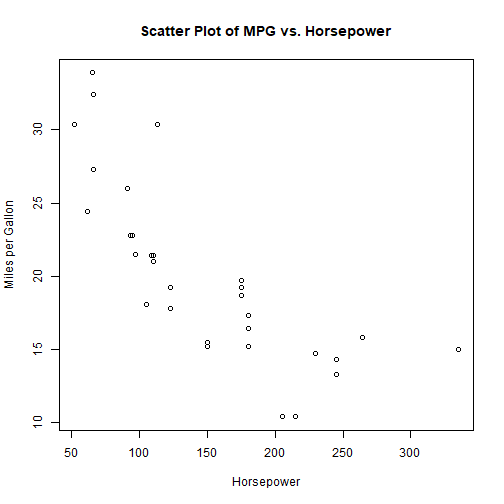
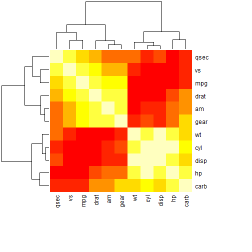
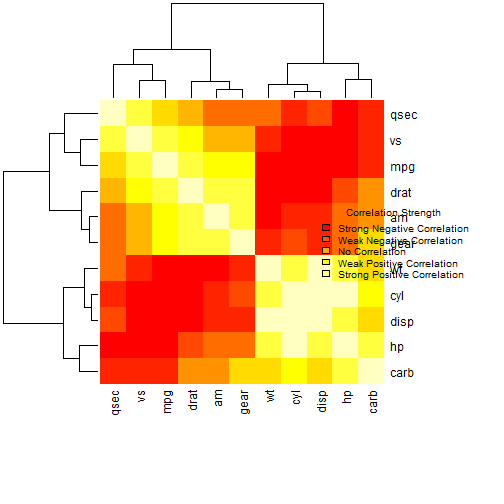

# Lecture 13: A real-world example of using R for data analysis
2024-08-31


<!--html_preserve--><details>
  <summary>Lecture index</summary>

- [Lecture 1: Introduction to R](/lectures/lecture_01/lecture_01.md)
- [Lecture 2: Objects, Data Types, and Variables in R](/lectures/lecture_02/lecture_02.md)
- [Lecture 3: Arithmetic Operations in R](/lectures/lecture_03/lecture_03.md)
- [Lecture 4: Comparison and Logical Operators in R](/lectures/lecture_04/lecture_04.md)
- [Lecture 5: Vectors in R](/lectures/lecture_05/lecture_05.md)
- [Lecture 6: List in R](/lectures/lecture_06/lecture_06.md)
- [Lecture 7: Matrices in R](/lectures/lecture_07/lecture_07.md)
- [Lecture 8: Data Frames in R](/lectures/lecture_08/lecture_08.md)
- [Lecture 9: Functions in R](/lectures/lecture_09/lecture_09.md)
- [Lecture 10: Indexing using Logical Vectors in R](/lectures/lecture_10/lecture_10.md)
- [Lecture 11: Factors in R](/lectures/lecture_11/lecture_11.md)
- [Lecture 12: Control Structures in R](/lectures/lecture_12/lecture_12.md)
- [Lecture 13: A real-world example of using R for data analysis](/lectures/lecture_13/lecture_13.md)

</details><!--/html_preserve--><!--html_preserve--><details>
  <summary>Exercise index</summary>

  - [Exercise 1: Introduction to R](/exercises/exercise_01/exercise_01.md)
  - [Exercise 1 Solutions: Introduction to R](/exercises/exercise_01/exercise_01_solutions.md)
  - [Exercise 2: Objects, Data Types, and Variables in R](/exercises/exercise_02/exercise_02.md)
  - [Exercise 2 Solutions: Objects, Data Types, and Variables in R](/exercises/exercise_02/exercise_02_solutions.md)
  - [Exercise 3: Arithmetic Operations in R](/exercises/exercise_03/exercise_03.md)
  - [Exercise 3 Solutions: Arithmetic Operations in R](/exercises/exercise_03/exercise_03_solutions.md)
  - [Exercise 4: Comparison and Logical Operators in R](/exercises/exercise_04/exercise_04.md)
  - [Exercise 4 Solutions: Comparison and Logical Operators in R](/exercises/exercise_04/exercise_04_solutions.md)
  - [Exercise 5: Vectors in R](/exercises/exercise_05/exercise_05.md)
  - [Exercise 5 Solutions: Vectors in R](/exercises/exercise_05/exercise_05_solutions.md)
  - [Exercise 6: List in R](/exercises/exercise_06/exercise_06.md)
  - [Exercise 6 Solutions: List in R](/exercises/exercise_06/exercise_06_solutions.md)
  - [Exercise 7: Matrices in R](/exercises/exercise_07/exercise_07.md)
  - [Exercise 7 Solutions: Matrices in R](/exercises/exercise_07/exercise_07_solutions.md)
  - [Exercise 8: Data Frames in R](/exercises/exercise_08/exercise_08.md)
  - [Exercise 8 Solutions: Data Frames in R](/exercises/exercise_08/exercise_08_solutions.md)
  - [Exercise 9: Functions in R](/exercises/exercise_09/exercise_09.md)
  - [Exercise 9 Solutions: Functions in R](/exercises/exercise_09/exercise_09_solutions.md)
  - [Exercise 10: Indexing using Logical Vectors in R](/exercises/exercise_10/exercise_10.md)
  - [Exercise 10 Solutions: Indexing using Logical Vectors in R](/exercises/exercise_10/exercise_10_solutions.md)
  - [Exercise 11: Factors in R](/exercises/exercise_11/exercise_11.md)
  - [Exercise 11 Solutions: Factors in R](/exercises/exercise_11/exercise_11_solutions.md)
  - [Exercise 12: Control Structures in R](/exercises/exercise_12/exercise_12.md)
  - [Exercise 12 Solutions: Control Structures in R](/exercises/exercise_12/exercise_12_solutions.md)
  - [Exercise 13: A real-world example of using R for data analysis](/exercises/exercise_13/exercise_13.md)
  - [Exercise 13 Solutions: A real-world example of using R for data
  analysis](/exercises/exercise_13/exercise_13_solutions.md)

</details><!--/html_preserve-->


In this lecture, we will work on a real-world example of using R for data
analysis. We will load a data set and perform some basic data exploration and
analysis.

## Load the data set

The data set we will be using is the `mtcars` data set, which is a built-in
data set in R. The data set contains information about various car models,
including the number of cylinders, horsepower, and miles per gallon (mpg).

Let's load the data set and take a look at the first few rows.

Load the mtcars data set


``` r
data(mtcars)
```

Display the first few rows of the data set


``` r
head(mtcars)
```

```
##                    mpg cyl disp  hp drat    wt  qsec vs am gear carb
## Mazda RX4         21.0   6  160 110 3.90 2.620 16.46  0  1    4    4
## Mazda RX4 Wag     21.0   6  160 110 3.90 2.875 17.02  0  1    4    4
## Datsun 710        22.8   4  108  93 3.85 2.320 18.61  1  1    4    1
## Hornet 4 Drive    21.4   6  258 110 3.08 3.215 19.44  1  0    3    1
## Hornet Sportabout 18.7   8  360 175 3.15 3.440 17.02  0  0    3    2
## Valiant           18.1   6  225 105 2.76 3.460 20.22  1  0    3    1
```

Check the structure of the data set


``` r
str(mtcars)
```

```
## 'data.frame':	32 obs. of  11 variables:
##  $ mpg : num  21 21 22.8 21.4 18.7 18.1 14.3 24.4 22.8 19.2 ...
##  $ cyl : num  6 6 4 6 8 6 8 4 4 6 ...
##  $ disp: num  160 160 108 258 360 ...
##  $ hp  : num  110 110 93 110 175 105 245 62 95 123 ...
##  $ drat: num  3.9 3.9 3.85 3.08 3.15 2.76 3.21 3.69 3.92 3.92 ...
##  $ wt  : num  2.62 2.88 2.32 3.21 3.44 ...
##  $ qsec: num  16.5 17 18.6 19.4 17 ...
##  $ vs  : num  0 0 1 1 0 1 0 1 1 1 ...
##  $ am  : num  1 1 1 0 0 0 0 0 0 0 ...
##  $ gear: num  4 4 4 3 3 3 3 4 4 4 ...
##  $ carb: num  4 4 1 1 2 1 4 2 2 4 ...
```

Summary of the data set


``` r
summary(mtcars)
```

```
##       mpg             cyl             disp             hp       
##  Min.   :10.40   Min.   :4.000   Min.   : 71.1   Min.   : 52.0  
##  1st Qu.:15.43   1st Qu.:4.000   1st Qu.:120.8   1st Qu.: 96.5  
##  Median :19.20   Median :6.000   Median :196.3   Median :123.0  
##  Mean   :20.09   Mean   :6.188   Mean   :230.7   Mean   :146.7  
##  3rd Qu.:22.80   3rd Qu.:8.000   3rd Qu.:326.0   3rd Qu.:180.0  
##  Max.   :33.90   Max.   :8.000   Max.   :472.0   Max.   :335.0  
##       drat             wt             qsec             vs        
##  Min.   :2.760   Min.   :1.513   Min.   :14.50   Min.   :0.0000  
##  1st Qu.:3.080   1st Qu.:2.581   1st Qu.:16.89   1st Qu.:0.0000  
##  Median :3.695   Median :3.325   Median :17.71   Median :0.0000  
##  Mean   :3.597   Mean   :3.217   Mean   :17.85   Mean   :0.4375  
##  3rd Qu.:3.920   3rd Qu.:3.610   3rd Qu.:18.90   3rd Qu.:1.0000  
##  Max.   :4.930   Max.   :5.424   Max.   :22.90   Max.   :1.0000  
##        am              gear            carb      
##  Min.   :0.0000   Min.   :3.000   Min.   :1.000  
##  1st Qu.:0.0000   1st Qu.:3.000   1st Qu.:2.000  
##  Median :0.0000   Median :4.000   Median :2.000  
##  Mean   :0.4062   Mean   :3.688   Mean   :2.812  
##  3rd Qu.:1.0000   3rd Qu.:4.000   3rd Qu.:4.000  
##  Max.   :1.0000   Max.   :5.000   Max.   :8.000
```

These steps provide us with an overview of the data set, including the column
names, data types, and summary statistics. We can see that the data set
contains 32 observations and 11 variables. The variables include the number
of cylinders, horsepower, and miles per gallon (mpg) of each car model. We
can use this information to perform further analysis and visualization of the
dataset.

The data set contains the following columns:

- mpg: Miles/(US) gallon
- cyl: Number of cylinders
- disp: Displacement (cu.in.)
- hp: Gross horsepower
- drat: Rear axle ratio
- wt: Weight (1000 lbs)
- qsec: 1/4 mile time
- vs: V/S

It is also possible to use the `help` function to get more information about
the data set (since it is a built-in data set in R).

Help on the mtcars data set


``` r
help(mtcars)
```

This provides additional information about the data set, including the source
and description of the dataset.

Now that we have loaded and explored the data set, we can perform further
analysis and visualization to gain insights from the data.

For example, we can create a scatter plot of miles per gallon (mpg) versus
horsepower to see if there is a relationship between the two variables.

Create a scatter plot of mpg vs. hp


``` r
plot(mtcars$hp,
     mtcars$mpg,
     xlab = "Horsepower",
     ylab = "Miles per Gallon",
     main = "Scatter Plot of MPG vs. Horsepower")
```



The scatter plot shows the relationship between miles per gallon (mpg) and
horsepower for the car models in the dataset. We can see that there is a
negative relationship between the two variables, with higher horsepower
values corresponding to lower miles per gallon values. The help page for the
plot() function provides more information about customizing plots and adding
labels and titles. It also informs us what the arguments are and how they can
be used.


``` r
?plot
```

We see that `x` and `y` are the variables to be plotted, `xlab` and `ylab` are the
labels for the `x` and `y` axes, and `main` is the title of the plot. Again, the
help function is a valuable resource for learning more about functions and
how to use them in R.

Let's continue exploring the data set and performing further analysis to gain
insights from the data.

For instance we can calculate the correlation between the variables in the
dataset.

Calculate the correlation matrix


``` r
correlation_matrix <- cor(mtcars)
```

Display the correlation matrix


``` r
print(correlation_matrix)
```

```
##             mpg        cyl       disp         hp        drat         wt
## mpg   1.0000000 -0.8521620 -0.8475514 -0.7761684  0.68117191 -0.8676594
## cyl  -0.8521620  1.0000000  0.9020329  0.8324475 -0.69993811  0.7824958
## disp -0.8475514  0.9020329  1.0000000  0.7909486 -0.71021393  0.8879799
## hp   -0.7761684  0.8324475  0.7909486  1.0000000 -0.44875912  0.6587479
## drat  0.6811719 -0.6999381 -0.7102139 -0.4487591  1.00000000 -0.7124406
## wt   -0.8676594  0.7824958  0.8879799  0.6587479 -0.71244065  1.0000000
## qsec  0.4186840 -0.5912421 -0.4336979 -0.7082234  0.09120476 -0.1747159
## vs    0.6640389 -0.8108118 -0.7104159 -0.7230967  0.44027846 -0.5549157
## am    0.5998324 -0.5226070 -0.5912270 -0.2432043  0.71271113 -0.6924953
## gear  0.4802848 -0.4926866 -0.5555692 -0.1257043  0.69961013 -0.5832870
## carb -0.5509251  0.5269883  0.3949769  0.7498125 -0.09078980  0.4276059
##             qsec         vs          am       gear        carb
## mpg   0.41868403  0.6640389  0.59983243  0.4802848 -0.55092507
## cyl  -0.59124207 -0.8108118 -0.52260705 -0.4926866  0.52698829
## disp -0.43369788 -0.7104159 -0.59122704 -0.5555692  0.39497686
## hp   -0.70822339 -0.7230967 -0.24320426 -0.1257043  0.74981247
## drat  0.09120476  0.4402785  0.71271113  0.6996101 -0.09078980
## wt   -0.17471588 -0.5549157 -0.69249526 -0.5832870  0.42760594
## qsec  1.00000000  0.7445354 -0.22986086 -0.2126822 -0.65624923
## vs    0.74453544  1.0000000  0.16834512  0.2060233 -0.56960714
## am   -0.22986086  0.1683451  1.00000000  0.7940588  0.05753435
## gear -0.21268223  0.2060233  0.79405876  1.0000000  0.27407284
## carb -0.65624923 -0.5696071  0.05753435  0.2740728  1.00000000
```

It is clear that the correlation matrix provides information about the
relationships between the variables in the dataset. We can see that some
variables are positively correlated, while others are negatively correlated.

We can also visualize the correlation matrix using a heatmap to better
understand the relationships between the variables.

Create a heatmap of the correlation matrix


``` r
heatmap(
  correlation_matrix,
  col = heat.colors(10),
  symm = TRUE,
  margins = c(10, 10)
)
```



Note that we can organize the code in a more readable way by breaking it into
multiple lines. This makes it easier to understand and modify the code. The
linebreaks can occur after commas or operators.

The heatmap provides a visual representation of the correlation matrix, with
warmer colors indicating stronger positive correlations and cooler colors
indicating stronger negative correlations. This visualization can help us
identify patterns and relationships between the variables in the dataset.

Let's add a legend to the heatmap to better understand the color scale.

Add a legend to the heatmap. Added the heatmap code again since the legend
needs to be added after the heatmap is created, which is not possible in
RMarkdown unless evaluated in the same code chunk. This is a workaround,
and not necessary for regular R scripts since the plot already exists.


``` r
heatmap(
  correlation_matrix,
  col = heat.colors(10),
  symm = TRUE,
  margins = c(20, 20)
)
legend(
  "right",
  legend = c(
    "Strong Negative Correlation",
    "Weak Negative Correlation",
    "No Correlation",
    "Weak Positive Correlation",
    "Strong Positive Correlation"
  ),
  fill = heat.colors(5),
  bty = "n",
  ncol = 1,
  cex = 0.8,
  title = "Correlation Strength",
  inset = c(0.05, 0)
)
```



The legend provides a key to the color scale used in the heatmap, indicating
the strength of the correlation between variables. This additional
information helps us interpret the heatmap and understand the relationships
between the variables in the dataset.

In this lecture, we worked on a real-world example of using R for data
analysis. We loaded the `mtcars` data set, explored the data, created
visualizations, and calculated the correlation between variables. These steps
demonstrate how R can be used to analyze and visualize data, gain insights,
and make data-driven decisions.

We encourage you to explore the data set further, try different
visualizations, and perform additional analysis to deepen your understanding
of the data.

That's it for this lecture! In the next lecture, we will cover more advanced
topics in R and explore additional data analysis techniques.


<!--html_preserve--><details>
  <summary>Lecture index</summary>

- [Lecture 1: Introduction to R](/lectures/lecture_01/lecture_01.md)
- [Lecture 2: Objects, Data Types, and Variables in R](/lectures/lecture_02/lecture_02.md)
- [Lecture 3: Arithmetic Operations in R](/lectures/lecture_03/lecture_03.md)
- [Lecture 4: Comparison and Logical Operators in R](/lectures/lecture_04/lecture_04.md)
- [Lecture 5: Vectors in R](/lectures/lecture_05/lecture_05.md)
- [Lecture 6: List in R](/lectures/lecture_06/lecture_06.md)
- [Lecture 7: Matrices in R](/lectures/lecture_07/lecture_07.md)
- [Lecture 8: Data Frames in R](/lectures/lecture_08/lecture_08.md)
- [Lecture 9: Functions in R](/lectures/lecture_09/lecture_09.md)
- [Lecture 10: Indexing using Logical Vectors in R](/lectures/lecture_10/lecture_10.md)
- [Lecture 11: Factors in R](/lectures/lecture_11/lecture_11.md)
- [Lecture 12: Control Structures in R](/lectures/lecture_12/lecture_12.md)
- [Lecture 13: A real-world example of using R for data analysis](/lectures/lecture_13/lecture_13.md)

</details><!--/html_preserve--><!--html_preserve--><details>
  <summary>Exercise index</summary>

  - [Exercise 1: Introduction to R](/exercises/exercise_01/exercise_01.md)
  - [Exercise 1 Solutions: Introduction to R](/exercises/exercise_01/exercise_01_solutions.md)
  - [Exercise 2: Objects, Data Types, and Variables in R](/exercises/exercise_02/exercise_02.md)
  - [Exercise 2 Solutions: Objects, Data Types, and Variables in R](/exercises/exercise_02/exercise_02_solutions.md)
  - [Exercise 3: Arithmetic Operations in R](/exercises/exercise_03/exercise_03.md)
  - [Exercise 3 Solutions: Arithmetic Operations in R](/exercises/exercise_03/exercise_03_solutions.md)
  - [Exercise 4: Comparison and Logical Operators in R](/exercises/exercise_04/exercise_04.md)
  - [Exercise 4 Solutions: Comparison and Logical Operators in R](/exercises/exercise_04/exercise_04_solutions.md)
  - [Exercise 5: Vectors in R](/exercises/exercise_05/exercise_05.md)
  - [Exercise 5 Solutions: Vectors in R](/exercises/exercise_05/exercise_05_solutions.md)
  - [Exercise 6: List in R](/exercises/exercise_06/exercise_06.md)
  - [Exercise 6 Solutions: List in R](/exercises/exercise_06/exercise_06_solutions.md)
  - [Exercise 7: Matrices in R](/exercises/exercise_07/exercise_07.md)
  - [Exercise 7 Solutions: Matrices in R](/exercises/exercise_07/exercise_07_solutions.md)
  - [Exercise 8: Data Frames in R](/exercises/exercise_08/exercise_08.md)
  - [Exercise 8 Solutions: Data Frames in R](/exercises/exercise_08/exercise_08_solutions.md)
  - [Exercise 9: Functions in R](/exercises/exercise_09/exercise_09.md)
  - [Exercise 9 Solutions: Functions in R](/exercises/exercise_09/exercise_09_solutions.md)
  - [Exercise 10: Indexing using Logical Vectors in R](/exercises/exercise_10/exercise_10.md)
  - [Exercise 10 Solutions: Indexing using Logical Vectors in R](/exercises/exercise_10/exercise_10_solutions.md)
  - [Exercise 11: Factors in R](/exercises/exercise_11/exercise_11.md)
  - [Exercise 11 Solutions: Factors in R](/exercises/exercise_11/exercise_11_solutions.md)
  - [Exercise 12: Control Structures in R](/exercises/exercise_12/exercise_12.md)
  - [Exercise 12 Solutions: Control Structures in R](/exercises/exercise_12/exercise_12_solutions.md)
  - [Exercise 13: A real-world example of using R for data analysis](/exercises/exercise_13/exercise_13.md)
  - [Exercise 13 Solutions: A real-world example of using R for data
  analysis](/exercises/exercise_13/exercise_13_solutions.md)

</details><!--/html_preserve-->

